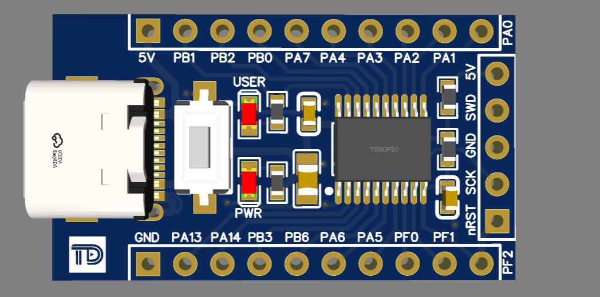

# PY32 Development Resource
---
__Easy buy online at Linh Kiện Thủ Đức store here :)__

- __[Development kit for SSOP10 package](https://linhkienthuduc.com/kit-phat-trien-py32f002-tssop20-ho-tro-lap-trinh-arm-cortex-m0)__ - Development board for package SSOP10
- __[Development kit for TSSOP20 package](https://linhkienthuduc.com/kit-phat-trien-py32f002-ssop10-ho-tro-lap-trinh-arm-cortex-m0)__ - Development board for package TSSOP20
- __[MCU TSSOP20 package](https://linhkienthuduc.com/kit-phat-trien-py32f002-tssop20-ho-tro-lap-trinh-arm-cortex-m0)__ - PY32F002AF15P6TU package TSSOP20
- __[MCU TSSOP20 package](https://linhkienthuduc.com/py32f002aa15m6tu-essop-10-vi-dieu-khien-32bit-arm-cortex-m0-mcu)__ - PY32F002AA15M6TU package SSOP10

Examble code and toolchain download can be found here: __[Project tempate and user guide: https://github.com/TDLOGY/py32f0-template-project/](https://github.com/TDLOGY/py32f0-template-project/)__

This repo contains hardware circuit digram, pictures and SDK for PY32 MCU

**PY32F002_SSOP10**

**PY32F002_TSSOP20**

